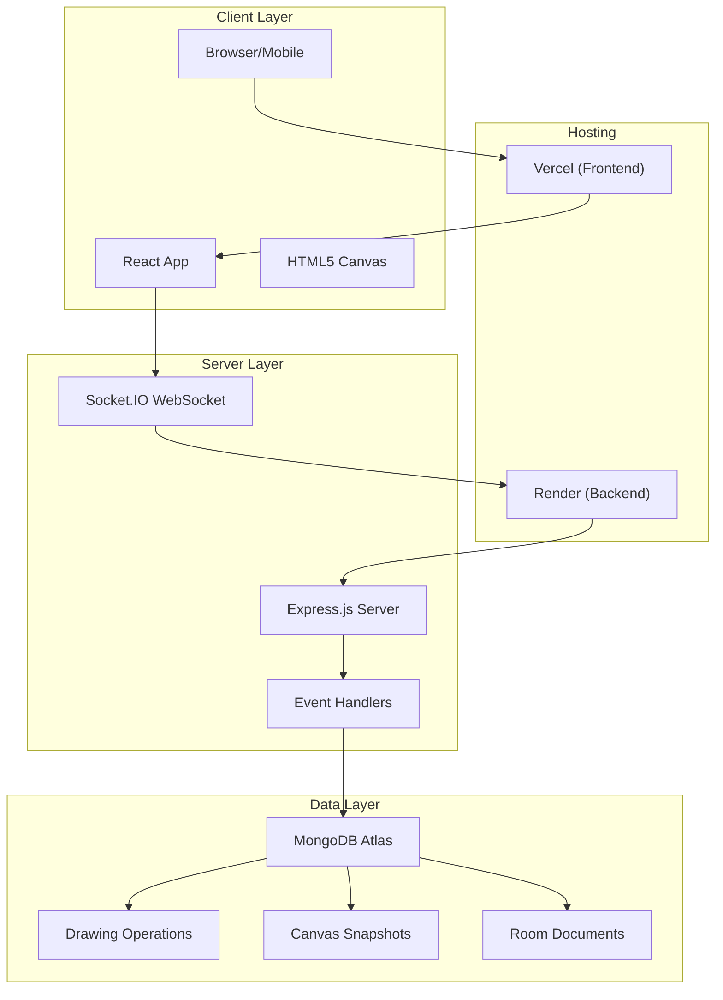
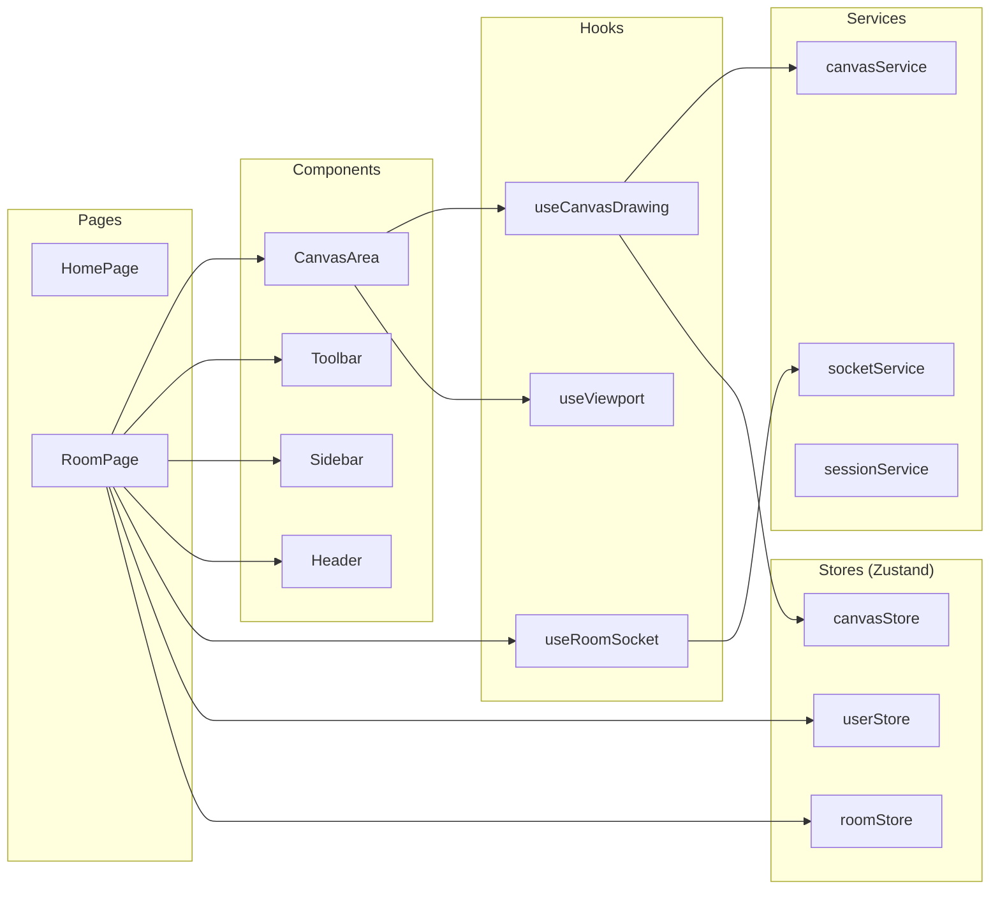
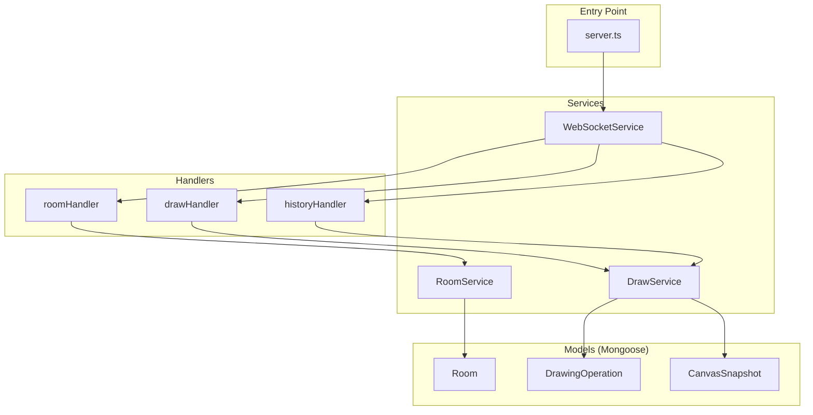
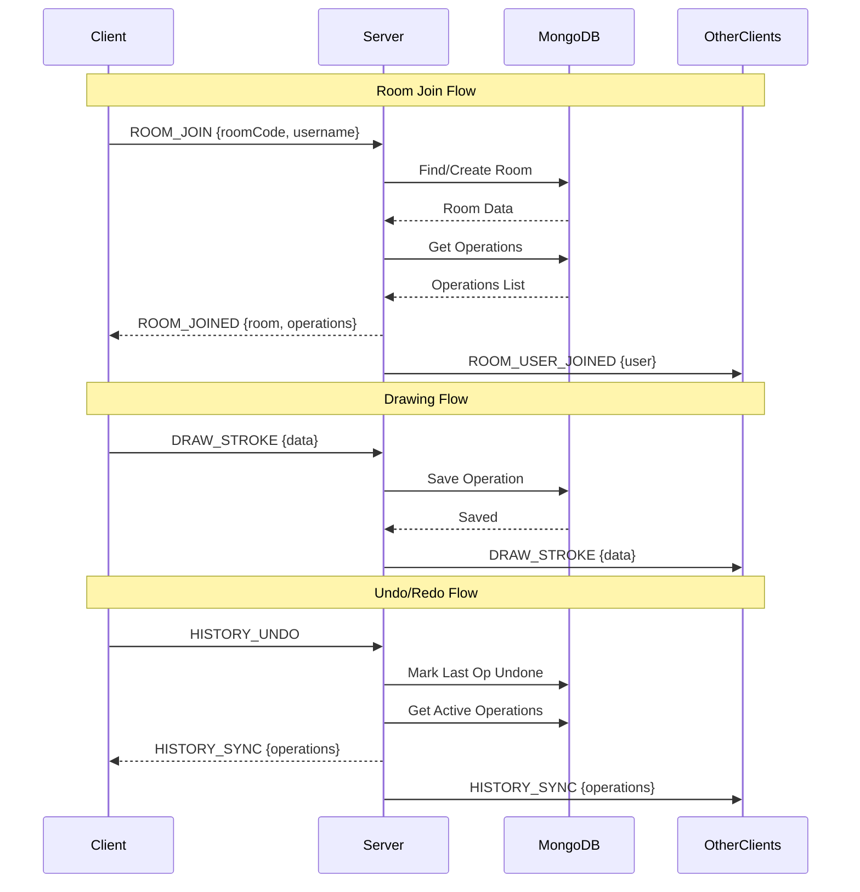
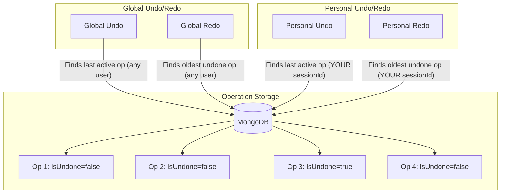
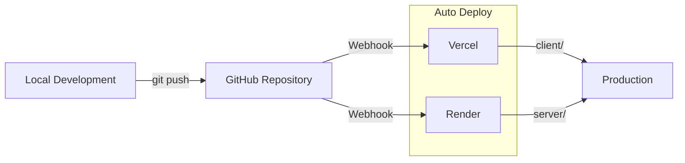

# Collaborative Canvas - Architecture Documentation

## System Overview



---

## Client Architecture



---

## Server Architecture



---

## WebSocket Event Flow



---

## Undo/Redo Architecture



### Undo/Redo Logic

| Type | Undo | Redo |
|------|------|------|
| **Global** | Last active op from ANY user → `isUndone=true` | Oldest undone op from ANY user → `isUndone=false` |
| **Personal** | Last active op from YOUR session → `isUndone=true` | Oldest undone op from YOUR session → `isUndone=false` |

---

## Data Models

### DrawingOperation
```typescript
{
  roomId: string,
  sessionId: string,      // Who drew it
  sequenceNumber: number, // Order in timeline
  type: 'stroke' | 'shape' | 'text' | 'clear',
  data: {
    points?: Point[],     // For strokes
    shape?: ShapeData,    // For shapes
    text?: TextData,      // For text
  },
  isUndone: boolean,      // Undo flag
  timestamp: Date
}
```

### Room
```typescript
{
  code: string,           // 6-char unique code
  name: string,
  createdBy: string,      // sessionId of creator
  users: [{
    sessionId: string,
    username: string,
    isAdmin: boolean
  }],
  createdAt: Date
}
```

### CanvasSnapshot
```typescript
{
  roomId: string,
  imageData: string,      // Base64 PNG
  sequenceNumber: number, // Snapshot point
  createdAt: Date
}
```

---

## Technology Stack

| Layer | Technology |
|-------|------------|
| **Frontend** | React 18, TypeScript, Vite, Tailwind CSS |
| **State Management** | Zustand |
| **Canvas** | HTML5 Canvas API |
| **Real-time** | Socket.IO |
| **Backend** | Node.js, Express, TypeScript |
| **Database** | MongoDB Atlas (Mongoose ODM) |
| **Frontend Hosting** | Vercel |
| **Backend Hosting** | Render |

---

## File Structure

```
collaborative-canvas/
├── client/                    # React frontend
│   ├── src/
│   │   ├── components/        # UI components
│   │   │   ├── room/          # Room-specific (Toolbar, Canvas, Sidebar)
│   │   │   ├── toolbar/       # Toolbar content panels
│   │   │   └── ui/            # Reusable UI components
│   │   ├── contexts/          # React contexts (Viewport)
│   │   ├── hooks/             # Custom hooks
│   │   ├── pages/             # Route pages
│   │   ├── services/          # API/Socket services
│   │   ├── stores/            # Zustand stores
│   │   └── types/             # TypeScript types
│   └── package.json
│
├── server/                    # Node.js backend
│   ├── src/
│   │   ├── handlers/          # Socket event handlers
│   │   ├── models/            # Mongoose models
│   │   ├── services/          # Business logic
│   │   └── types/             # TypeScript types
│   └── package.json
│
└── package.json               # Root package (concurrently runs both)
```

---

## Deployment Flow



| Service | Branch | Root Directory | Build Command |
|---------|--------|----------------|---------------|
| Vercel | master | `client/` | `npm run build` |
| Render | master | `server/` | `npm run build` |
